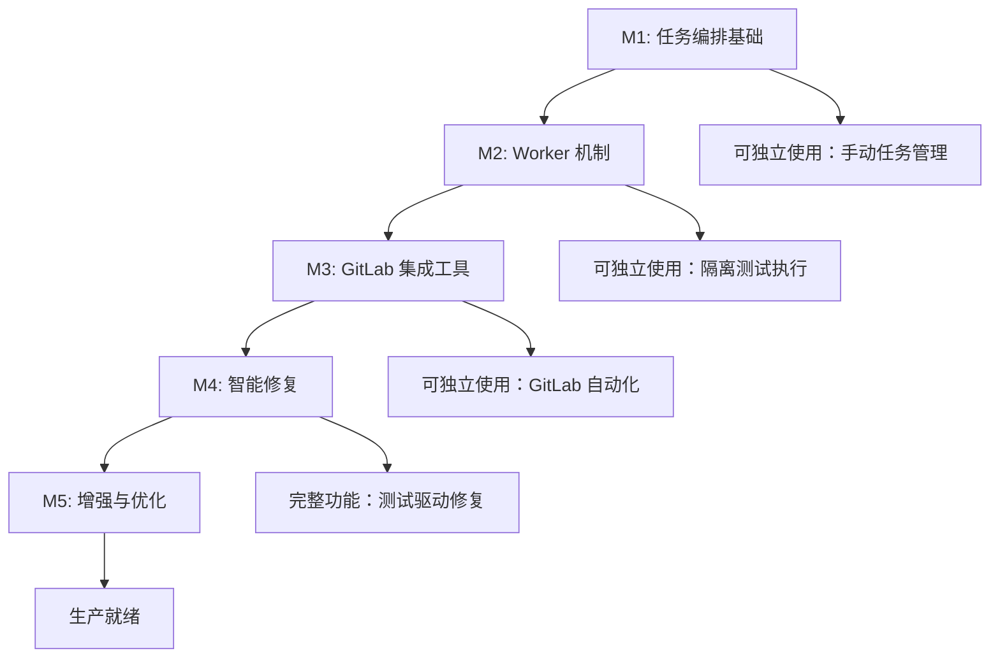

# 实现改进方案 - 对齐文档与代码

> 基于 `commit-branch-test-repair.md` 设计文档与当前代码库的对比分析

## 📊 现状分析

### 当前实现的优势

✅ **核心能力已具备**
- **AgentCoordinator**: 多 Agent 协同框架，支持并行执行、优先级调度、自动重试
- **TestAgent**: 完整的测试生成流程（矩阵分析 + 4 种场景并行生成）
- **工具链完整**: fetch-commit-changes → analyze-test-matrix → generate-tests → write-test-file → run-tests
- **性能优化**: OpenAI 响应缓存、p-limit 并发控制、自动去重
- **FastMCP 架构**: HTTP Streaming 支持，无需自定义传输层

✅ **已有的外部集成**
- **n8n/GitLab 支持**: analyze-raw-diff-test-matrix, generate-tests-from-raw-diff
- **Phabricator 集成**: fetch-diff, publish-phabricator-comments（已在其他分支）

### 当前实现与文档设计的差异

| 模块 | 文档设计 | 当前实现 | 差距 |
|------|---------|---------|-----|
| **Worker 机制** | ✅ worker 线程隔离任务、测试执行 | ❌ 无 worker 机制 | **缺少** |
| **GitLab 集成** | ✅ 自动监听 MR、创建 MR、管理分支 | ❌ 仅支持外部 raw diff | **缺少** |
| **Workspace Manager** | ✅ Git 工作区管理、clone/fetch/checkout | ❌ 无工作区生命周期管理 | **缺少** |
| **Task Manager** | ✅ 任务状态机、并发控制、事件广播 | ⚠️ 仅有 AgentCoordinator | **部分缺失** |
| **Fix Agent** | ✅ 基于失败日志智能修复 | ❌ 无修复循环 | **缺少** |
| **回归验证** | ✅ 重新执行失败测试、多轮修复 | ❌ 无验证循环 | **缺少** |
| **GitOps** | ✅ 自动 commit/push/MR | ❌ 无自动化 | **缺少** |
| **测试执行** | ✅ worker 隔离、依赖安装、超时控制 | ⚠️ run-tests 工具但无隔离 | **需增强** |
| **Agent 系统** | ⚠️ 需要 Analysis/Fix/Test 三类 | ✅ TestAgent + AgentCoordinator | **已有** |

### 关键发现

1. **架构选择分歧**：
   - 文档强调 "Worker + 多 Agent 协同"，理由是隔离任务、避免阻塞
   - 当前实现基于 MCP 工具 + FastMCP，无 worker 机制
   - **评估**：MCP 场景下，长时间任务（测试、LLM 调用）确实可能阻塞 SSE 长连接

2. **GitLab 自动化缺失**：
   - 文档设计面向 "feature 分支 → master MR" 的自动化触发场景
   - 当前实现需要外部系统（n8n）提供 raw diff，缺少端到端 GitLab 集成

3. **修复循环缺失**：
   - 文档核心价值：测试驱动修复 + 回归验证
   - 当前实现：生成测试 → 写入文件 → 执行测试（停止）
   - 缺少：失败分析 → 智能修复 → 重新测试的闭环

---

## 🎯 改进方案设计

### 设计原则

1. **兼容现有架构**：保留 FastMCP + MCP 工具的基础架构
2. **渐进式增强**：分阶段实现，每个阶段都是可用的完整功能
3. **可选 Worker 机制**：提供 worker 模式（隔离任务），但默认使用直接调用（简单场景）
4. **模块化设计**：新增功能作为独立模块，不破坏现有工具

### 架构改进

```
src/
  orchestrator/              # 新增：任务编排
    task-manager.ts          # 任务状态机、并发控制、事件广播
    workspace-manager.ts     # Git 工作区生命周期管理
    task-types.ts            # 任务接口定义
  
  agents/
    test-agent.ts            # 已有
    test-matrix-analyzer.ts  # 已有
    fix-agent.ts             # 新增：智能修复
    base.ts                  # 已有
  
  workers/                   # 新增：Worker 隔离
    test-runner-worker.ts    # 测试执行 worker
    fix-worker.ts            # 修复 worker（可选，集成 Q CLI）
    worker-pool.ts           # Worker 池管理
  
  tools/
    # 已有工具保持不变
    # 新增 GitLab 工具
    gitlab-test-repair-start.ts   # 启动测试修复任务
    gitlab-task-status.ts         # 查询任务状态
    gitlab-create-mr.ts           # 创建 MR
  
  clients/
    gitlab-client.ts         # 新增：GitLab API 客户端
    openai.ts                # 已有
    embedding.ts             # 已有
  
  core/                      # 已有核心模块保持不变
    agent-coordinator.ts
    react-engine.ts
    ...
```

---

## 📋 实现里程碑

### M1: 任务编排基础（优先级 P0）

**目标**：实现任务状态机和工作区管理，支持长时间任务追踪

#### 交付物

1. **orchestrator/task-types.ts** - 任务接口定义
```typescript
interface TestRepairTask {
  id: string;
  gitlabProjectId: string;
  featureBranch: string;
  baselineBranch: string;  // 默认 master
  status: 'pending' | 'workspace-ready' | 'analyzing' | 'testing' | 'fixing' | 'completed' | 'failed';
  progress: number;        // 0-100
  workDir?: string;
  result?: TestRepairResult;
  createdAt: number;
  updatedAt: number;
}

interface TestRepairResult {
  testsGenerated: number;
  testsPassed: number;
  testsFailed: number;
  fixAttempts: number;
  filesChanged: string[];
  mrUrl?: string;
}
```

2. **orchestrator/task-manager.ts** - 任务状态管理
```typescript
export class TaskManager {
  private tasks = new Map<string, TestRepairTask>();
  private eventEmitter = new EventEmitter();
  
  // 创建任务
  createTask(config: TaskConfig): string;
  
  // 更新任务状态
  updateTask(taskId: string, updates: Partial<TestRepairTask>): void;
  
  // 查询任务
  getTask(taskId: string): TestRepairTask | undefined;
  
  // 事件监听
  on(event: 'progress' | 'status-change' | 'completed', handler: Function): void;
  
  // 并发控制
  private maxConcurrent = 3;
  private runningTasks = new Set<string>();
}
```

3. **orchestrator/workspace-manager.ts** - Git 工作区管理
```typescript
export class WorkspaceManager {
  // 创建工作区（clone + checkout）
  async createWorkspace(config: {
    projectId: string;
    featureBranch: string;
    baselineBranch: string;
    gitlabToken: string;
  }): Promise<string>; // 返回 workDir 路径
  
  // 获取变更（diff）
  async getDiff(workDir: string, baselineBranch: string): Promise<string>;
  
  // 清理工作区
  async cleanup(workDir: string): Promise<void>;
  
  // Git 操作封装
  private async gitClone(repoUrl: string, workDir: string): Promise<void>;
  private async gitFetch(workDir: string, branch: string): Promise<void>;
  private async gitCheckout(workDir: string, branch: string): Promise<void>;
  private async gitCommit(workDir: string, message: string): Promise<void>;
  private async gitPush(workDir: string, branch: string): Promise<void>;
}
```

4. **clients/gitlab-client.ts** - GitLab API 客户端
```typescript
export class GitLabClient {
  constructor(private token: string, private baseUrl: string);
  
  // 获取项目信息
  async getProject(projectId: string): Promise<GitLabProject>;
  
  // 创建 MR
  async createMergeRequest(config: {
    projectId: string;
    sourceBranch: string;
    targetBranch: string;
    title: string;
    description: string;
  }): Promise<{ mrUrl: string; mrId: number }>;
  
  // 添加 MR 评论
  async addMRComment(projectId: string, mrId: number, comment: string): Promise<void>;
}
```

#### 验证标准
- ✅ 可以创建任务并追踪状态
- ✅ 可以创建 Git 工作区并获取 diff
- ✅ 可以清理工作区
- ✅ 任务状态持久化到内存（可选：磁盘）

---

### M2: Worker 机制（优先级 P0）

**目标**：实现 worker 线程隔离，支持长时间测试执行

#### 交付物

1. **workers/worker-pool.ts** - Worker 池管理
```typescript
export class WorkerPool {
  constructor(private maxWorkers: number = 3);
  
  // 执行任务
  async executeTask<T>(
    workerPath: string,
    message: WorkerMessage
  ): Promise<T>;
  
  // 终止 worker
  async terminateWorker(workerId: string): Promise<void>;
  
  // 清理所有 worker
  async cleanup(): Promise<void>;
}
```

2. **workers/test-runner-worker.ts** - 测试执行 worker
```typescript
// worker 线程代码
import { parentPort } from 'worker_threads';

interface TestRunnerMessage {
  type: 'install' | 'run';
  workDir: string;
  testCommand?: string;
  testFiles?: string[];
  timeout?: number;
}

parentPort?.on('message', async (msg: TestRunnerMessage) => {
  try {
    if (msg.type === 'install') {
      // 安装依赖
      const result = await installDependencies(msg.workDir);
      parentPort?.postMessage({ success: true, result });
    } else if (msg.type === 'run') {
      // 执行测试
      const result = await runTests(msg.workDir, msg.testFiles, msg.timeout);
      parentPort?.postMessage({ success: true, result });
    }
  } catch (error) {
    parentPort?.postMessage({ success: false, error: error.message });
  }
});
```

3. **更新 run-tests.ts 工具** - 使用 worker 执行
```typescript
export class RunTestsTool extends BaseTool {
  async executeImpl(args: RunTestsArgs): Promise<RunTestsResult> {
    const workerPool = getAppContext().workerPool;
    
    if (workerPool) {
      // 使用 worker 执行
      const result = await workerPool.executeTask<TestRunResult>(
        './workers/test-runner-worker.js',
        {
          type: 'run',
          workDir: args.projectRoot,
          testFiles: args.testFiles,
          timeout: args.timeout,
        }
      );
      return result;
    } else {
      // 回退到直接执行
      return this.runTestsDirectly(args);
    }
  }
}
```

#### 验证标准
- ✅ 测试执行不阻塞主线程
- ✅ 支持超时控制和强制终止
- ✅ Worker 崩溃不影响主进程
- ✅ 支持多个 worker 并发执行

---

### M3: GitLab 集成工具（优先级 P1）

**目标**：实现端到端 GitLab 自动化，支持 MR 触发和结果输出

#### 交付物

1. **tools/gitlab-test-repair-start.ts** - 启动测试修复任务
```typescript
export interface GitLabTestRepairStartArgs {
  gitlabProjectId: string;
  featureBranch: string;
  baselineBranch?: string;        // 默认 master
  gitlabToken?: string;            // 可选，优先从 env 读取
  testCommand?: string;            // 默认 pnpm test
  maxFixAttempts?: number;         // 默认 3
  timeoutMs?: number;              // 默认 30 分钟
}

export class GitLabTestRepairStartTool extends BaseTool {
  async executeImpl(args: GitLabTestRepairStartArgs): Promise<{
    taskId: string;
    status: string;
    message: string;
  }> {
    const taskManager = getAppContext().taskManager;
    const workspaceManager = getAppContext().workspaceManager;
    
    // 1. 创建任务
    const taskId = taskManager.createTask({
      gitlabProjectId: args.gitlabProjectId,
      featureBranch: args.featureBranch,
      baselineBranch: args.baselineBranch || 'master',
    });
    
    // 2. 异步执行任务（不阻塞返回）
    this.executeTaskAsync(taskId, args).catch((error) => {
      taskManager.updateTask(taskId, { 
        status: 'failed', 
        error: error.message 
      });
    });
    
    return {
      taskId,
      status: 'pending',
      message: `Task created. Use gitlab-task-status to check progress.`,
    };
  }
  
  private async executeTaskAsync(taskId: string, args: GitLabTestRepairStartArgs) {
    // 详细流程见下文
  }
}
```

2. **tools/gitlab-task-status.ts** - 查询任务状态
```typescript
export interface GitLabTaskStatusArgs {
  taskId: string;
}

export class GitLabTaskStatusTool extends BaseTool {
  async executeImpl(args: GitLabTaskStatusArgs): Promise<TestRepairTask> {
    const taskManager = getAppContext().taskManager;
    const task = taskManager.getTask(args.taskId);
    
    if (!task) {
      throw new Error(`Task ${args.taskId} not found`);
    }
    
    return task;
  }
}
```

3. **tools/gitlab-create-mr.ts** - 创建 MR
```typescript
export interface GitLabCreateMRArgs {
  projectId: string;
  sourceBranch: string;
  targetBranch: string;
  title: string;
  description: string;
  gitlabToken?: string;
}

export class GitLabCreateMRTool extends BaseTool {
  async executeImpl(args: GitLabCreateMRArgs): Promise<{
    mrUrl: string;
    mrId: number;
  }> {
    const gitlabClient = new GitLabClient(
      args.gitlabToken || process.env.GITLAB_TOKEN!,
      process.env.GITLAB_BASE_URL || 'https://gitlab.com'
    );
    
    return gitlabClient.createMergeRequest({
      projectId: args.projectId,
      sourceBranch: args.sourceBranch,
      targetBranch: args.targetBranch,
      title: args.title,
      description: args.description,
    });
  }
}
```

#### 任务执行流程（详细）

```typescript
// 在 GitLabTestRepairStartTool.executeTaskAsync 中
private async executeTaskAsync(taskId: string, args: GitLabTestRepairStartArgs) {
  const taskManager = getAppContext().taskManager;
  const workspaceManager = getAppContext().workspaceManager;
  const state = getAppContext().state;
  
  try {
    // === 阶段 A: 工作区初始化 ===
    taskManager.updateTask(taskId, { status: 'workspace-setup', progress: 10 });
    
    const workDir = await workspaceManager.createWorkspace({
      projectId: args.gitlabProjectId,
      featureBranch: args.featureBranch,
      baselineBranch: args.baselineBranch || 'master',
      gitlabToken: args.gitlabToken || process.env.GITLAB_TOKEN!,
    });
    
    taskManager.updateTask(taskId, { 
      status: 'workspace-ready', 
      workDir,
      progress: 20 
    });
    
    // === 阶段 B: 变更分析 & 测试矩阵 ===
    taskManager.updateTask(taskId, { status: 'analyzing', progress: 30 });
    
    const diff = await workspaceManager.getDiff(workDir, args.baselineBranch || 'master');
    
    // 调用现有的 analyze-test-matrix 工具
    const matrixTool = new AnalyzeTestMatrixTool(getAppContext().openai, state);
    const matrixResult = await matrixTool.execute({
      rawDiff: diff,
      identifier: taskId,
      projectRoot: workDir,
    });
    
    if (!matrixResult.success) {
      throw new Error('Test matrix analysis failed');
    }
    
    taskManager.updateTask(taskId, { progress: 40 });
    
    // === 阶段 C: 测试用例生成 ===
    taskManager.updateTask(taskId, { status: 'generating-tests', progress: 50 });
    
    const generateTool = new GenerateTestsTool(
      getAppContext().openai,
      getAppContext().embedding,
      state,
      getAppContext().contextStore
    );
    
    const testsResult = await generateTool.execute({
      rawDiff: diff,
      identifier: taskId,
      projectRoot: workDir,
      analyzeMatrix: false, // 已经分析过了
    });
    
    if (!testsResult.success) {
      throw new Error('Test generation failed');
    }
    
    const tests = testsResult.data?.tests || [];
    taskManager.updateTask(taskId, { progress: 60 });
    
    // === 阶段 D: 写入测试文件 ===
    const writeTool = new WriteTestFileTool();
    const writeResult = await writeTool.execute({
      tests,
      projectRoot: workDir,
      overwrite: false,
    });
    
    taskManager.updateTask(taskId, { progress: 70 });
    
    // === 阶段 E: 测试执行 & 修复循环 ===
    taskManager.updateTask(taskId, { status: 'testing', progress: 75 });
    
    const runTool = new RunTestsTool();
    let testResult = await runTool.execute({
      projectRoot: workDir,
      testFiles: writeResult.data?.filesWritten,
      timeout: 60000,
    });
    
    let fixAttempts = 0;
    const maxAttempts = args.maxFixAttempts || 3;
    
    // 修复循环
    while (!testResult.success && fixAttempts < maxAttempts) {
      taskManager.updateTask(taskId, { 
        status: 'fixing', 
        progress: 75 + (fixAttempts + 1) * 5 
      });
      
      // TODO: 调用 FixAgent 进行修复
      // const fixAgent = new FixAgent(...);
      // const fixResult = await fixAgent.fix(testResult.data?.failures);
      
      // 重新执行测试
      testResult = await runTool.execute({
        projectRoot: workDir,
        testFiles: writeResult.data?.filesWritten,
        timeout: 60000,
      });
      
      fixAttempts++;
    }
    
    taskManager.updateTask(taskId, { progress: 90 });
    
    // === 阶段 F: GitOps 输出 ===
    taskManager.updateTask(taskId, { status: 'creating-mr', progress: 95 });
    
    // Commit 变更
    await workspaceManager.commit(workDir, 
      `[${args.featureBranch}] test-driven verification\n\n` +
      `- Generated ${tests.length} tests\n` +
      `- Passed: ${testResult.data?.summary.passed}\n` +
      `- Failed: ${testResult.data?.summary.failed}\n` +
      `- Fix attempts: ${fixAttempts}`
    );
    
    // Push 到远程
    const branchName = `ai-verify/${args.featureBranch}/${Date.now()}`;
    await workspaceManager.push(workDir, branchName);
    
    // 创建 MR
    const mrTool = new GitLabCreateMRTool();
    const mrResult = await mrTool.execute({
      projectId: args.gitlabProjectId,
      sourceBranch: branchName,
      targetBranch: args.baselineBranch || 'master',
      title: `Test verification for ${args.featureBranch}`,
      description: this.generateMRDescription(tests, testResult, fixAttempts),
      gitlabToken: args.gitlabToken,
    });
    
    // 完成任务
    taskManager.updateTask(taskId, { 
      status: 'completed', 
      progress: 100,
      result: {
        testsGenerated: tests.length,
        testsPassed: testResult.data?.summary.passed || 0,
        testsFailed: testResult.data?.summary.failed || 0,
        fixAttempts,
        filesChanged: writeResult.data?.filesWritten || [],
        mrUrl: mrResult.mrUrl,
      }
    });
    
  } catch (error) {
    logger.error(`[Task:${taskId}] Execution failed`, { error });
    taskManager.updateTask(taskId, { 
      status: 'failed',
      error: error.message 
    });
  } finally {
    // 清理工作区（可选保留以便调试）
    if (process.env.CLEANUP_WORKSPACE !== 'false') {
      await workspaceManager.cleanup(workDir);
    }
  }
}
```

#### 验证标准
- ✅ 可以通过工具触发完整的测试修复流程
- ✅ 可以查询任务进度和结果
- ✅ 可以自动创建 MR 并附带测试摘要
- ✅ 支持异步执行，不阻塞 MCP 响应

---

### M4: 智能修复（优先级 P1）

**目标**：基于失败日志生成修复补丁，实现测试驱动修复闭环

#### 交付物

1. **agents/fix-agent.ts** - 智能修复 Agent
```typescript
export interface FixContext {
  failures: TestFailure[];      // 失败的测试
  sourceFiles: string[];         // 相关源文件
  testFiles: string[];           // 失败的测试文件
  diff?: string;                 // 原始 diff（可选）
}

export interface TestFailure {
  testName: string;
  testFile: string;
  errorMessage: string;
  stackTrace: string;
  expectedBehavior?: string;
}

export class FixAgent extends BaseAgent<FixPatch> {
  constructor(private llm: OpenAIClient) {
    super('fix-agent');
  }
  
  async execute(context: FixContext): Promise<AgentResult<FixPatch>> {
    // 1. 分析失败原因
    const analysis = await this.analyzeFailures(context);
    
    // 2. 生成修复建议
    const fixes = await this.generateFixes(analysis, context);
    
    // 3. 应用补丁
    const patches = await this.applyPatches(fixes);
    
    return {
      items: patches,
      summary: {
        totalFailures: context.failures.length,
        fixesGenerated: patches.length,
        confidence: this.calculateConfidence(patches),
      },
    };
  }
  
  private async analyzeFailures(context: FixContext): Promise<FailureAnalysis[]> {
    const prompt = this.buildAnalysisPrompt(context);
    const response = await this.llm.chatCompletion({
      messages: [{ role: 'user', content: prompt }],
      temperature: 0.2,
    });
    // 解析分析结果
    return this.parseAnalysisResponse(response);
  }
  
  private async generateFixes(
    analysis: FailureAnalysis[],
    context: FixContext
  ): Promise<FixSuggestion[]> {
    const prompt = this.buildFixPrompt(analysis, context);
    const response = await this.llm.chatCompletion({
      messages: [{ role: 'user', content: prompt }],
      temperature: 0.3,
    });
    return this.parseFixResponse(response);
  }
}
```

2. **更新 GitLabTestRepairStartTool** - 集成 FixAgent
```typescript
// 在测试执行循环中添加修复逻辑
while (!testResult.success && fixAttempts < maxAttempts) {
  const failures = this.parseTestFailures(testResult);
  
  const fixAgent = new FixAgent(getAppContext().openai);
  const fixResult = await fixAgent.execute({
    failures,
    sourceFiles: this.getRelatedSourceFiles(failures, workDir),
    testFiles: writeResult.data?.filesWritten || [],
  });
  
  if (fixResult.items.length > 0) {
    // 应用补丁
    for (const patch of fixResult.items) {
      await this.applyPatch(workDir, patch);
    }
    
    // 重新执行测试
    testResult = await runTool.execute({
      projectRoot: workDir,
      testFiles: writeResult.data?.filesWritten,
      timeout: 60000,
    });
  }
  
  fixAttempts++;
}
```

3. **Prompt 模板** - prompts/fix-agent.md
```markdown
# 测试失败修复

你是一个专业的代码修复 Agent，负责分析测试失败原因并生成修复补丁。

## 输入

### 失败的测试
{failures}

### 相关源文件
{sourceFiles}

### 测试文件
{testFiles}

## 任务

1. **分析失败原因**：
   - 理解测试的预期行为
   - 定位失败的具体原因（逻辑错误、边界条件、状态问题等）
   - 识别需要修复的源文件

2. **生成修复方案**：
   - 提供最小化的修复补丁（diff 格式）
   - 确保修复不影响其他测试
   - 优先修复源代码，必要时修复测试代码

3. **置信度评估**：
   - 对每个修复方案给出置信度（0-1）
   - 解释修复的理由

## 输出格式

```json
{
  "fixes": [
    {
      "file": "src/components/Button.tsx",
      "patch": "--- a/src/components/Button.tsx\n+++ b/src/components/Button.tsx\n...",
      "reason": "修复按钮点击事件未绑定的问题",
      "confidence": 0.9
    }
  ]
}
```
```

#### 验证标准
- ✅ 可以基于失败日志生成修复建议
- ✅ 可以自动应用补丁
- ✅ 修复后重新执行测试
- ✅ 支持多轮修复（最多 N 次）

---

### M5: 增强与优化（优先级 P2）

**目标**：完善配置、监控、文档和安全性

#### 交付物

1. **配置增强** - 新增环境变量
```bash
# GitLab 配置
GITLAB_TOKEN=glpat-xxx
GITLAB_BASE_URL=https://gitlab.com

# 任务配置
TASK_MAX_CONCURRENT=3                  # 最大并发任务数
TASK_TIMEOUT_MS=1800000                # 30 分钟超时
TASK_CLEANUP_WORKSPACE=true            # 完成后清理工作区
TASK_TEST_INSTALL_TIMEOUT=300000       # 依赖安装超时 5 分钟

# Worker 配置
WORKER_ENABLED=true                    # 启用 worker 模式
WORKER_MAX_POOL=3                      # worker 池大小
WORKER_TIMEOUT_MS=600000               # worker 超时 10 分钟

# 修复配置
FIX_MAX_ATTEMPTS=3                     # 最大修复尝试次数
FIX_AGENT_MODEL=gpt-4                  # 修复使用的模型
```

2. **监控增强** - 扩展 Metrics
```typescript
// 新增指标
getMetrics().recordCounter('task.created', 1, { projectId });
getMetrics().recordCounter('task.completed', 1, { status, duration });
getMetrics().recordHistogram('task.duration', duration, { status });
getMetrics().recordGauge('task.running', runningCount);
getMetrics().recordCounter('fix.attempt', 1, { success });
```

3. **文档更新**
- README.md - 添加 GitLab 集成使用指南
- docs/gitlab-integration.md - GitLab 工作流详细说明
- docs/fix-agent-guide.md - 修复 Agent 使用指南

4. **安全加固**
- Worker 环境变量隔离（仅注入必要的 token）
- 工作区路径校验（防止路径遍历）
- Git 操作超时和重试机制
- 敏感信息脱敏（日志中的 token）

5. **测试覆盖**
- workspace-manager 单元测试
- task-manager 单元测试
- worker-pool 单元测试
- GitLab 工具集成测试

#### 验证标准
- ✅ 所有配置可通过环境变量或配置文件设置
- ✅ 监控指标完整记录任务生命周期
- ✅ 文档清晰，有完整示例
- ✅ 安全问题已识别并修复
- ✅ 核心模块测试覆盖率 > 80%

---

## 🔄 实施策略

### 开发顺序



### 兼容性保证

1. **现有工具不受影响**：
   - fetch-commit-changes, analyze-test-matrix, generate-tests 等工具保持不变
   - 新增工具作为独立模块，不破坏现有调用方式

2. **渐进式启用**：
   - Worker 机制默认禁用，通过 `WORKER_ENABLED=true` 启用
   - GitLab 工具需要配置 `GITLAB_TOKEN` 才可用
   - Fix Agent 可选，不影响基础测试生成流程

3. **向后兼容**：
   - 所有新增的环境变量都有合理的默认值
   - 现有工具输出格式不变

### 里程碑检查点

| 里程碑 | 预估工时 | 验证方式 | 阻塞关系 |
|--------|---------|---------|---------|
| M1 | 2-3 天 | 单元测试 + 手动测试 | 无 |
| M2 | 2-3 天 | Worker 隔离验证 | 依赖 M1 |
| M3 | 3-4 天 | GitLab 集成测试 | 依赖 M1, M2 |
| M4 | 3-4 天 | 修复循环验证 | 依赖 M3 |
| M5 | 2-3 天 | 文档审查 + 安全审计 | 依赖 M4 |

**总预估工时**：12-17 天

---

## 📝 使用示例

### 场景 1：快速启动测试修复任务

```bash
# 1. 配置环境变量
export GITLAB_TOKEN=glpat-xxx
export OPENAI_API_KEY=sk-xxx
export WORKER_ENABLED=true

# 2. 启动 MCP 服务器
npm start

# 3. 通过 MCP 客户端调用工具
gitlab-test-repair-start {
  "gitlabProjectId": "123",
  "featureBranch": "feature/payments-v2",
  "baselineBranch": "master",
  "maxFixAttempts": 3
}

# 返回
{
  "taskId": "task-1234567890",
  "status": "pending",
  "message": "Task created. Use gitlab-task-status to check progress."
}

# 4. 查询任务状态
gitlab-task-status {
  "taskId": "task-1234567890"
}

# 返回
{
  "id": "task-1234567890",
  "status": "completed",
  "progress": 100,
  "result": {
    "testsGenerated": 24,
    "testsPassed": 22,
    "testsFailed": 2,
    "fixAttempts": 1,
    "mrUrl": "https://gitlab.com/org/repo/-/merge_requests/456"
  }
}
```

### 场景 2：仅生成测试（不修复）

```bash
# 使用现有工具
generate-tests-from-raw-diff {
  "rawDiff": "...",
  "identifier": "mr-456",
  "projectRoot": "/path/to/project"
}
```

### 场景 3：n8n 工作流集成

```
GitLab Webhook (MR created)
  ↓
n8n HTTP Request (获取 diff)
  ↓
n8n MCP Call: gitlab-test-repair-start
  ↓
n8n Schedule: 轮询 gitlab-task-status (每 30s)
  ↓
n8n Condition: status === 'completed'
  ↓
n8n Notification: 发送通知到 Slack
```

---

## ✅ 成功标准

### 功能完整性
- ✅ 支持从 GitLab MR 自动触发测试生成
- ✅ 支持测试失败后的自动修复
- ✅ 支持多轮修复和回归验证
- ✅ 支持自动创建 MR 并附带测试摘要

### 性能指标
- ✅ 任务不阻塞 MCP 服务器响应（< 1s 返回 taskId）
- ✅ Worker 隔离测试执行，不影响其他任务
- ✅ 支持 3 个并发任务
- ✅ 工作区创建 < 30s（取决于仓库大小）

### 可用性
- ✅ 文档完整，有清晰的使用示例
- ✅ 错误信息友好，便于调试
- ✅ 支持任务状态追踪和进度查询
- ✅ 支持手动清理和资源回收

### 可维护性
- ✅ 代码模块化，职责清晰
- ✅ 核心模块有单元测试
- ✅ 日志完整，便于排查问题
- ✅ 配置灵活，支持不同环境

---

## 🔍 与现有架构的关系

### 保留的优势
1. **FastMCP 架构**：继续使用 HTTP Streaming，无需自定义传输层
2. **AgentCoordinator**：复用现有的多 Agent 协同框架
3. **工具链完整**：保留所有现有的 MCP 工具
4. **性能优化**：保留 OpenAI 响应缓存、并发控制等优化

### 新增的能力
1. **任务编排**：支持长时间任务的状态追踪
2. **Worker 隔离**：避免阻塞主线程
3. **GitLab 集成**：端到端自动化
4. **智能修复**：测试驱动修复闭环

### 架构图

```
┌─────────────────────────────────────────────────────────────┐
│                    FastMCP Server (HTTP Streaming)          │
│                                                               │
│  ┌─────────────┐  ┌─────────────┐  ┌─────────────┐         │
│  │ 现有工具     │  │ GitLab 工具  │  │ Task 工具   │         │
│  │ - fetch-*   │  │ - start      │  │ - status    │         │
│  │ - analyze-* │  │ - create-mr  │  └─────────────┘         │
│  │ - generate-*│  └─────────────┘                           │
│  │ - write-*   │                                             │
│  │ - run-*     │                                             │
│  └─────────────┘                                             │
│         │                │                  │                │
│         ▼                ▼                  ▼                │
│  ┌──────────────────────────────────────────────────┐       │
│  │           Orchestrator Layer                      │       │
│  │  ┌─────────────┐  ┌──────────────────┐           │       │
│  │  │TaskManager  │  │WorkspaceManager  │           │       │
│  │  └─────────────┘  └──────────────────┘           │       │
│  └──────────────────────────────────────────────────┘       │
│         │                                                     │
│         ▼                                                     │
│  ┌──────────────────────────────────────────────────┐       │
│  │           Agent Layer (保留)                      │       │
│  │  ┌──────────┐  ┌──────────┐  ┌──────────┐       │       │
│  │  │TestAgent │  │FixAgent  │  │Analyzer  │       │       │
│  │  └──────────┘  └──────────┘  └──────────┘       │       │
│  │         ▲                                         │       │
│  │         │ AgentCoordinator (并发控制)            │       │
│  └──────────────────────────────────────────────────┘       │
│         │                                                     │
│         ▼                                                     │
│  ┌──────────────────────────────────────────────────┐       │
│  │           Worker Layer (新增)                     │       │
│  │  ┌─────────────┐  ┌──────────────┐               │       │
│  │  │TestRunner   │  │FixWorker     │               │       │
│  │  │Worker       │  │(可选)        │               │       │
│  │  └─────────────┘  └──────────────┘               │       │
│  └──────────────────────────────────────────────────┘       │
│         │                                                     │
│         ▼                                                     │
│  ┌──────────────────────────────────────────────────┐       │
│  │           Client Layer (保留)                     │       │
│  │  ┌──────────┐  ┌──────────┐  ┌──────────┐       │       │
│  │  │OpenAI    │  │Embedding │  │GitLab    │       │       │
│  │  └──────────┘  └──────────┘  └──────────┘       │       │
│  └──────────────────────────────────────────────────┘       │
└─────────────────────────────────────────────────────────────┘
```

---

## 📚 参考资料

- 原始设计文档：`commit-branch-test-repair.md`
- 当前项目状态：`.project-status`
- FastMCP 文档：https://github.com/jlowin/fastmcp
- GitLab API 文档：https://docs.gitlab.com/ee/api/

---

## 🤝 贡献指南

### 实现者指引

1. **按里程碑顺序实现**：M1 → M2 → M3 → M4 → M5
2. **每个里程碑完成后**：
   - 编写单元测试
   - 更新文档
   - 在 PR 中引用对应里程碑
   - 通过验证标准
3. **代码风格**：遵循现有项目的 TypeScript 风格
4. **Commit 规范**：使用 `[M1]`, `[M2]` 等前缀标识里程碑

### 常见问题

**Q: Worker 机制是否必需？**
A: 对于短时间任务（< 5s）可以不使用 worker。但对于长时间测试执行（> 30s）和多并发场景，worker 可以避免阻塞 FastMCP 的 SSE 长连接。

**Q: 与 n8n 集成的工具会受影响吗？**
A: 不会。现有的 `analyze-raw-diff-test-matrix` 和 `generate-tests-from-raw-diff` 工具保持不变，可以继续使用。

**Q: FixAgent 必须使用 Q CLI 吗？**
A: 不一定。FixAgent 可以直接调用 OpenAI API 生成修复补丁，Q CLI 是可选的增强方案。

**Q: 任务状态如何持久化？**
A: M1 阶段使用内存存储即可。后续可以扩展到 Redis 或文件系统。

---

## 📅 更新日志

- **2024-11-15**: 初始版本，基于 commit-branch-test-repair.md 和当前代码库分析
